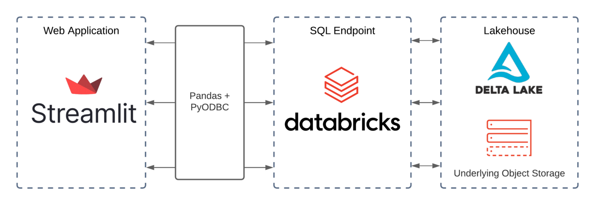
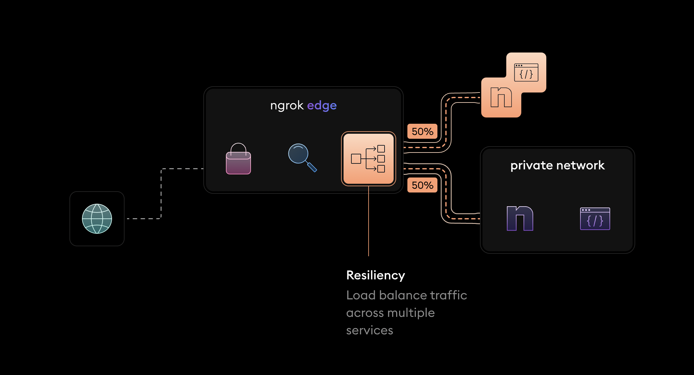

# Streamlit

## Overview

<p float="left">
    
    
</p>

## Demo

Start the jupyter notebook, which runs in http://localhost:8888.
```bash
jupyter notebook
```

Start the streamlit, which runs in http://localhost:8501.
```bash
streamlit run app.py
```

Share the address over Internet by `ngrok`:
1. Download `ngrok` for `arm64` by https://ngrok.com/download;
2. `unzip ~/Downloads/ngrok-v3-stable-darwin-arm64.zip -d /Users/shu/bin`
```bash
ngrok config add-authtoken 2BqZkoJrrbhDyrPvTad5uRiywvJ_6YHstVohzXtGWYkNL6uw2

ngrok http 8501

Session Status                online
Account                       nezumikozo (Plan: Free)
Version                       3.0.6
Region                        Europe (eu)
Latency                       14ms
Web Interface                 http://127.0.0.1:4040
Forwarding                    https://b1ff-145-136-149-195.eu.ngrok.io -> http://localhost:8501
```

## References

* https://spark.apache.org/docs/latest/sql-getting-started.html#global-temporary-view
* https://spark.apache.org/docs/latest/sql-data-sources-hive-tables.html
* https://stackoverflow.com/questions/47855375/pyspark-only-runs-using-sudo
* https://codesolid.com/pip-vs-pipenv-which-is-better-and-which-to-learn-first/
* https://medium.com/analytics-vidhya/deploy-flask-streamlit-apps-from-jupyter-notebook-and-google-colab-5c3729dc3647
* https://polarpersonal.medium.com/building-data-visualization-apps-with-streamlit-and-databricks-sql-54e51bb6b0a8
* https://docs.streamlit.io/library/api-reference/charts/st.line_chart
* https://levelup.gitconnected.com/build-a-practical-timeline-in-streamlit-5b3603ade11c
* https://plotly.com/python/legend/
